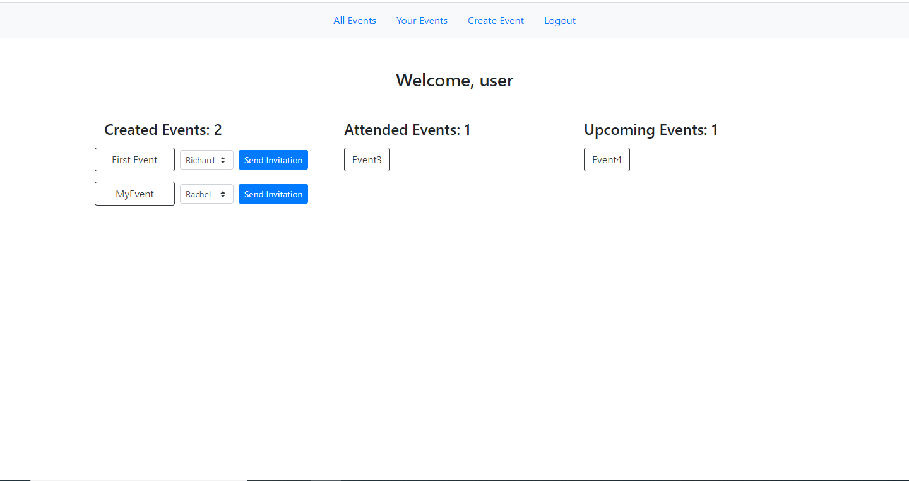

# Members Only

> The purpose of this project was to learn about associations in rails

For this project I created a web page that lets users create events and invite other users to them. A user can only attend an event if he/she is invited first. See full task [here](https://www.theodinproject.com/courses/ruby-on-rails/lessons/associations#project-private-events)

## Built With

- Ruby
- Ruby on Rails
- Bootstrap

## Getting Started

You will need:
- Ruby
- Ruby on Rails
- Bundler

### Install

Clone the repo

`git clone git@github.com:Blasco9/Private-Events.git`

Install dependencies

`bundle install`

Run the server

`rails server`

### Usage

Once you have started the server you will be able to register as a user and then create events and invite other users

## Authors

👤 **Julian Blasco**

- Github: [@Blasco9](https://github.com/Blasco9)
- Linkedin: [Julian Blasco](https://www.linkedin.com/in/julian-augusto-blasco-1656a0153/)

## 🤝 Contributing

Contributions, issues and feature requests are welcome!

Feel free to check the [issues page](issues/).

## Show your support

Give a ⭐️ if you like this project!

## Acknowledgments

- The Odin Project
- Microverse

## 📝 License

This project is [MIT](lic.url) licensed.